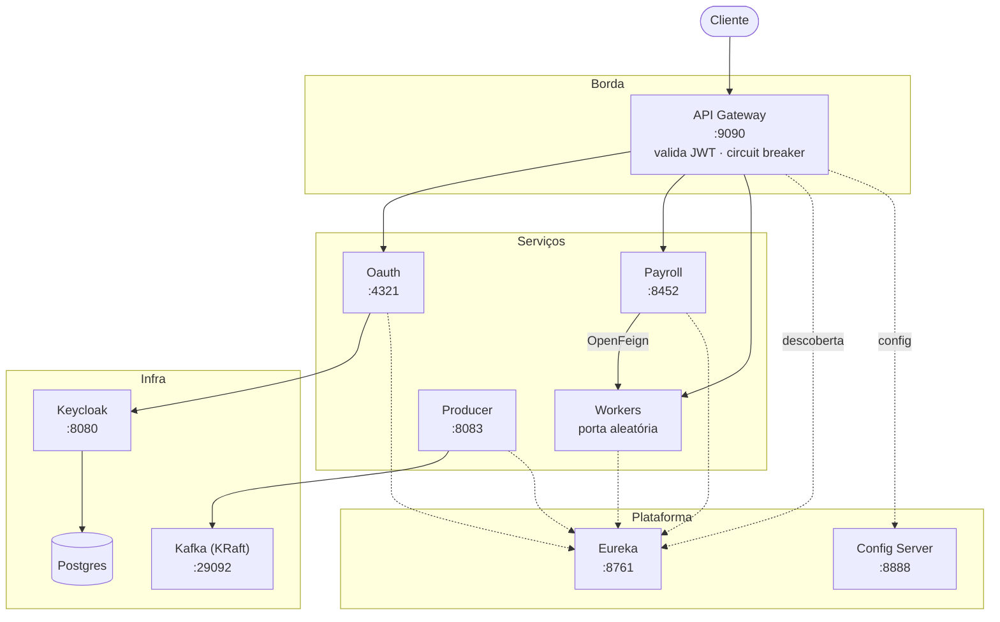

# Microservices

Arquitetura de microserviços em Spring Boot 4 / Spring Cloud 2025, com service discovery,
API Gateway, configuração centralizada, autenticação via Keycloak e mensageria Kafka.

A stack inteira sobe com um comando.

## Arquitetura



O Gateway descobre os serviços pelo Eureka e roteia automaticamente por nome
(`/payroll/**` chega no serviço `PAYROLL`). Rotas que não sejam `/oauth/**`
exigem um JWT válido emitido pelo Keycloak.

## Stack

| Componente | Versão |
|---|---|
| Java | 21 |
| Spring Boot | 4.0.8 |
| Spring Cloud | 2025.1.3 |
| Spring Cloud Gateway | 5.0.3 (WebFlux) |
| Spring Security | 7.0.7 |
| Keycloak | 26.4 |
| Kafka | 4.1 (KRaft, sem Zookeeper) |
| Postgres | 17 |

## Como executar

Requisito: Docker. Não é preciso ter Java nem Maven instalados — o build acontece
dentro do container.

```bash
docker compose up --build
```

A primeira execução leva alguns minutos (build do reactor + download das imagens).
Quando terminar, os serviços se registram no Eureka em até ~30s.

| Serviço | URL |
|---|---|
| API Gateway | http://localhost:9090 |
| Eureka | http://localhost:8761 |
| Config Server | http://localhost:8888 |
| Keycloak (admin/admin) | http://localhost:8080 |
| Kafka UI | http://localhost:7777 |

Para derrubar tudo, incluindo o banco do Keycloak:

```bash
docker compose down -v
```

## Exemplo de uso

O realm `my-realm` é importado automaticamente, já com o usuário `demo` / `demo12345`.

**1. Obter um token**

```bash
TOKEN=$(curl -s -X POST http://localhost:9090/oauth/auth \
  -H "Content-Type: application/json" \
  -d '{"username":"demo","password":"demo12345"}' | jq -r .accessToken)
```

**2. Acessar uma rota protegida**

```bash
curl -H "Authorization: Bearer $TOKEN" \
  http://localhost:9090/payroll/payments/1/days/20
# {"name":"Bob","dailyIncome":200.0,"days":20,"total":4000.0}
```

Sem o header, a mesma rota responde `401`.

**3. Inspecionar um token**

```bash
curl -X POST http://localhost:9090/oauth/validate -H "Authorization: Bearer $TOKEN"
```

A validação confere a assinatura contra o JWKS do realm, além de issuer e expiração.

**4. Criar um usuário**

```bash
curl -X POST http://localhost:9090/oauth/create \
  -H "Content-Type: application/json" \
  -d '{"username":"joao","email":"joao@example.com","password":"senha12345"}'
```

**5. Publicar uma mensagem no Kafka**

```bash
curl -X POST http://localhost:8083/messages \
  -H "Content-Type: application/json" \
  -d '{"topic":"demo-topic","key":"k1","message":"ola"}'
```

A mensagem aparece no Kafka UI em http://localhost:7777.

## Módulos

| Diretório | Artefato | Descrição |
|---|---|---|
| [Eureka/](Eureka/) | `Eureka` | Service discovery |
| [Config-Server/](Config-Server/) | `Config-Server` | Configuração centralizada via Git |
| [API-Gateway/](API-Gateway/) | `gateway` | Roteamento, validação de JWT, circuit breaker |
| [Oauth/Integration/](Oauth/Integration/) | `oauth` | Emissão e validação de token via Keycloak |
| [Kafka-Server/Producer/](Kafka-Server/Producer/) | `Producer` | Publicação de mensagens no Kafka |
| [Deprecated-Services/Workers/](Deprecated-Services/Workers/) | `Workers` | Serviço de recurso (JPA + H2) |
| [Deprecated-Services/Payroll/](Deprecated-Services/Payroll/) | `Payroll` | Consome Workers via OpenFeign |

## Desenvolvimento local

Com JDK 21 instalado:

```bash
./mvnw clean install
```

Sem JDK, usando Docker:

```bash
docker run --rm -v "$PWD":/app -w /app -v maven-repo:/root/.m2 \
  maven:3.9-eclipse-temurin-21 mvn clean install
```

Cada serviço tem `application.yml` completo e autossuficiente, com defaults para
execução local (`localhost`). Em Docker esses valores são sobrescritos por
variáveis de ambiente (`EUREKA_URI`, `CONFIG_SERVER_URI`, `KEYCLOAK_URL`, …).

### Config Server

O Config Server é **opcional**: os serviços usam `optional:configserver:`, então
sobem normalmente se ele não estiver disponível. Ele lê o repositório
[Microservices-config](https://github.com/LucasDiasJorge/Microservices-config),
que contém arquivos do perfil `dev`. Como os serviços rodam no perfil `default`,
nada de lá é aplicado por padrão.

### Variáveis de ambiente

Todos os valores usados pelo `docker-compose.yml` têm default de desenvolvimento,
então não é preciso criar nenhum arquivo para rodar. Para sobrescrever, copie
[.env.example](.env.example) para `.env`.

O secret do client Keycloak em `docker/keycloak/realm-import.json` é um valor de
desenvolvimento local, válido apenas dentro desta stack.

## Licença

MIT.
